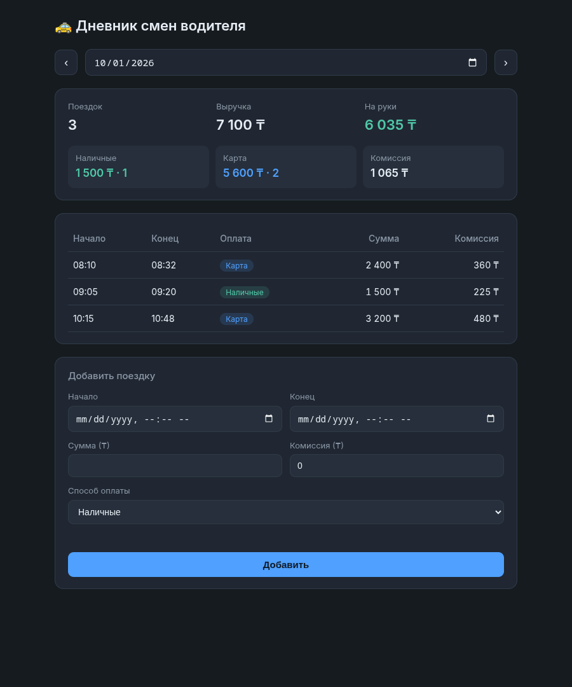

# Дневник смен водителя

Небольшое приложение для учёта поездок водителя: сервер на Go + веб-клиент на
vanilla JS. Данные хранятся в SQLite (`modernc.org/sqlite` — чистый Go, без CGO).
При первом запуске пустая база наполняется из `trips.json`.



## Что сделано

- **Сводка за день**: число поездок, выручка, комиссия, «на руки» (выручка − комиссия),
  разбивка наличные / карта (по сумме и количеству).
- **Список поездок** за выбранный день, сортировка по времени начала.
- **Переключение дней** стрелками ‹ › или через выбор даты.
- **Добавление поездки** через API с валидацией: `amount > 0`, окончание позже начала,
  способ оплаты `cash` | `card`, комиссия ≥ 0, времена в формате RFC3339.
- **Защита от дублей (идемпотентность)**: повторная отправка той же поездки не создаёт
  дубль — см. ниже.
- **Тесты** на расчёт сводки, защиту от дублей и HTTP API.

## Запуск

Нужен Go 1.26+ (этого требует драйвер `modernc.org/sqlite`; см. `go.mod`).

```bash
go build -o diary .
./diary                      # http://localhost:8080
# опции:
./diary -addr :9000 -db shift.db -seed trips.json
```

Важно: запускать пакет целиком (`go run .` или собранный `./diary`), а не
`go run main.go` — файл один из нескольких в пакете.

При старте создаётся файл БД `diary.db`; если он пуст, в него импортируются поездки
из `trips.json` (seed). Веб-клиент встроен в бинарник (`//go:embed`), поэтому
`./diary` — всё, что нужно. Открыть в браузере `http://localhost:8080`.

Флаги:

| Флаг | По умолчанию | Назначение |
|------|--------------|------------|
| `-addr` | `:8080` | адрес HTTP-сервера |
| `-db` | `diary.db` | файл SQLite-базы |
| `-seed` | `trips.json` | JSON для наполнения пустой базы |

## Тесты

```bash
go test ./...
```

Покрывают:
- `summary_test.go` — расчёт сводки (смешанные cash/card, пустой день);
- `store_test.go` — дедуп по `id`, дедуп по контенту (fingerprint), один и тот же
  момент в разных часовых смещениях, повтор поездки из seed без `id` / с другим `id`,
  конфликт `id`, валидация, дедуп после переоткрытия базы;
- `api_test.go` — HTTP через `httptest`: 201 → 200 на повтор, сводка после добавления,
  400 на невалидные данные / время без смещения / лишние поля, 409 на занятый `id`,
  400 на плохую дату.

Каждый тест работает со своей временной БД в `t.TempDir()`, рабочий `diary.db` не
трогается.

## API

| Метод | Путь | Описание |
|-------|------|----------|
| `GET` | `/api/trips?date=YYYY-MM-DD` | поездки за день |
| `GET` | `/api/summary?date=YYYY-MM-DD` | сводка за день |
| `POST`| `/api/trips` | добавить поездку (JSON в теле) |

Пример:

```bash
curl "http://localhost:8080/api/summary?date=2026-10-01"
# {"date":"2026-10-01","trips":3,"revenue":7100,"commission":1065,"net":6035,
#  "cash":{"trips":1,"amount":1500},"card":{"trips":2,"amount":5600}}

curl -X POST http://localhost:8080/api/trips \
  -H "Content-Type: application/json" \
  -d '{"start":"2026-10-01T14:00:00+05:00","end":"2026-10-01T14:25:00+05:00",
       "amount":2000,"payment":"cash","commission":300}'
```

Ответы `POST /api/trips`:

| Код | Когда |
|-----|-------|
| `201 Created` | поездка добавлена |
| `200 OK` | такая поездка уже есть — возвращается сохранённая запись, дубль не создаётся |
| `400 Bad Request` | невалидные данные (сумма ≤ 0, окончание не позже начала, время без смещения, неизвестное поле…) |
| `409 Conflict` | `id` уже занят поездкой с другими данными |

Ошибки приходят телом `{"error": "..."}`.

## Как устроена защита от дублей

У каждой поездки есть отпечаток содержимого — SHA-256 от `start + end + amount +
payment`, где время приведено к UTC. В таблице уникальны и `id`, и отпечаток, а вставка
идёт через `INSERT OR IGNORE`:

- повторный `POST` с тем же `id` и теми же данными → `200`, возвращается сохранённая
  запись;
- тот же `id`, но другие данные → `409 Conflict` (не молчаливое «успешно»);
- `id` не передан → он равен отпечатку, повторная отправка находит ту же запись;
- та же поездка, но без `id` или под другим `id` (например, поездка `t1` из seed,
  отправленная ещё раз из формы) → `200` с исходной записью `t1`;
- один и тот же момент в разных смещениях (`08:10+05:00` и `03:10Z`) — одна поездка.

Комиссия в отпечаток не входит: это не признак поездки, а начисление по ней.

## Модель данных

Хранилище — одна таблица `trips` в SQLite (`id` — PRIMARY KEY, `fingerprint` —
UNIQUE). Дедуп реализован через `INSERT OR IGNORE` + `RowsAffected`. Деньги хранятся как целые
(тенге). Поездки группируются по дню по календарной дате поля `start` в его
собственном часовом смещении (в SQL — `substr(start, 1, 10)`).

```json
{
  "id": "t1",
  "start": "2026-10-01T08:10:00+05:00",
  "end": "2026-10-01T08:32:00+05:00",
  "amount": 2400,
  "payment": "card",
  "commission": 360
}
```

## Структура

```
main.go          HTTP-роутинг, хендлеры, seed, отдача встроенного фронта
model.go         Trip, валидация, fingerprint, расчёт сводки
store.go         SQLite-хранилище с дедупом (INSERT OR IGNORE)
*_test.go        тесты сводки, дедупа и HTTP API
web/             index.html + app.js (vanilla JS)
trips.json       seed-данные
```

## Как использовался ИИ

Приложение написано с помощью Claude Code. ИИ сгенерировал почти весь код по короткой
спецификации; ревью и исправления — за мной.

Где ИИ ошибся / что поправил сам:

- **Часовые пояса на клиенте.** Первый вариант показывал время поездки, конвертируя его
  в часовой пояс браузера, из-за чего `08:10 +05:00` «съезжало». Исправлено: в списке
  показывается wall-clock прямо из строки RFC3339 (`iso.slice(11,16)`), а форма отправки
  явно добавляет смещение браузера к `datetime-local` (иначе Go не распарсил бы время
  без оффсета).
- **Пропущенный импорт.** В `model.go` использовался `strconv.FormatInt` без импорта
  `strconv` — добавил.
- **Дыры в защите от дублей.** Первая версия дедупила только по `id`: поездку `t1` из
  seed можно было отправить ещё раз без `id` и получить вторую копию; один и тот же
  момент в `+05:00` и в `Z` давал разные отпечатки; повтор `id` с другими данными
  молча возвращал старую запись с `200`. Сделал отпечаток в UTC уникальным в БД и
  добавил `409 Conflict` — каждый случай закрыт тестом (проверил, что тест падает на
  старом коде).
- **Все ошибки POST были `400`.** Ошибка БД тоже уходила как «плохой запрос» —
  развёл на 400 / 409 / 500.
- **Коллизия CSS-классов.** Панели и способ оплаты «карта» использовали один класс
  `.card`, из-за чего блок «Карта» в сводке был с рамкой и другого размера.
  Переименовал панели в `.panel`.
- **Клиент без обработки ошибок.** При падении сервера страница молча не обновлялась,
  а при быстром листании дней поздний ответ за старый день мог перезаписать текущий.
  Добавил плашку ошибки, отбрасывание устаревших ответов и блокировку кнопки на время
  отправки.
# arqa
